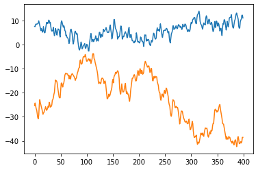

Principal Component Analysis and Cointegration
==============================================

This article outlines the relationship between Principal Component Anlaysis (PCA) and cointegration, and the basic idea behind Chigira (2008) cointegration test. 
It concludes with a Python simulation experiment that compares Chigira test with the Johansen test.

Recall that a prerequisite of cointegrated series is that every series has to be integrated of the same order. 
Let's denote :math:`I(d)` (`see definition here <https://en.wikipedia.org/wiki/Order_of_integration>`_) for integration of order :math:`d`. 
This means after :math:`d` times of taking difference (i.e. :math:`y_{t} - y_{t-1}`), the series becomes (*weak*) `stationary <https://en.wikipedia.org/wiki/Stationary_process#Weak_or_wide-sense_stationarity>`_. 
Here we will only explore the case of :math:`I(1)` series. In this case, cointegration simply says that there exists a linear combination of these integrated series such that the combination is stationary.

Further recall that (*linear*) `Principal Component Analysis <https://en.wikipedia.org/wiki/Principal_component_analysis>`_ seeks to find a `unit vector <https://en.wikipedia.org/wiki/Unit_vector>`_ that maximizes the variance after the vector is applied as weights to the original series. 
What immediately follows are:

- The maximized variance is the eigenvalue from the eigen-decomposition of the variance-covariance matrix of the original data. 

- The resulting eigenvector is the first *principal component*.

- The 2nd (or 3rd, 4th, ...) largest variance is the eignvalue of the variance-covariance matrix based on the residual data that the previous principal component(s) cannot explain. 

- Principal components (eigenvectors) are sometimes referred to as *factor loadings* in other fields of studies.

- Principal components are `orthonormal <https://en.wikipedia.org/wiki/Orthonormality>`_, i.e. the dot product is 0 between any two and is 1 with itself.

- The score of a principal component is the linear combination of the original series with the pricinpal component as the weights. We may also refer to a score as a factor. 

Chigira (2008) proved that if the last few scores are stationary, the original data are in fact cointegrated, provided each series in the data is :math:`I(1)`. 
Furthermore, the number of stationary factors equals the number of cointegration vectors.

Let :math:`\pmb{x}_{t}=[x^1_t, x^2_t, ..., x^l_t ]^\prime` denote a vector of variables from :math:`x^1_t` to :math:`x^l_t` for time period :math:`t`, properly demeaned and detrended. 
Just as Chigira (2008), we use a regression model with a constant, a time trend and no lagged terms to model out the mean and trend:

.. math::
    \begin{equation*}
        \pmb{y}_t = \mu + \sigma t + \pmb{x}_{t}
    \end{equation*}

where :math:`\pmb{x}_{t}` is simply the residual from the above model.

Let :math:`\pmb{B} = [\pmb{v}_1, ... , \pmb{v}_m]` be an :math:`l` by :math:`m` matrix of principal components, where :math:`l` is the total number of series / variables in the original data; :math:`m` is the intended number of principal components to keep. :math:`m` can be smaller than the number of variables :math:`l` when variable reduction is performed to reduce dimension.
The columns of :math:`\pmb{B}` are ordered descendingly according to the eigenvalues. 
The PCA scores are defined as:

.. math::
    \begin{align*}
        \pmb{s}_t &= \pmb{x}_{t}^\prime \pmb{B}\\
        &= \begin{bmatrix}
            \pmb{x}^\prime_{t} \pmb{v}_1  &... & \pmb{x}^\prime_{t} \pmb{v}_m\\
        \end{bmatrix}^\prime
    \end{align*}

Chigira cointegration test then becomes a test for stationary PCA scores. This implementation of the Chigira test utilizes the following procedure:

  1. :math:`i=0`, :math:`r=0`

  2. Run a unit root test (either `Phillips-Perron <https://en.wikipedia.org/wiki/Phillips%E2%80%93Perron_test>`_ or `Dickey-Fuller <https://en.wikipedia.org/wiki/Dickey%E2%80%93Fuller_test>`_) on :math:`\pmb{x}^\prime_t \pmb{v}_{m-i}` --- the PCA score with :math:`i`-th *smallest* eigenvalue

  3. If the test shows unit root, return :math:`r`

  4. If the test does not show a unit root, let :math:`r = i + 1`

  5. Unless :math:`i` = :math:`m`, increase :math:`i` by 1

The return variable :math:`r` represents the number of cointegrated vectors as in `Johansen cointegration <https://en.wikipedia.org/wiki/Johansen_test>`_ test.

One major benefit of the Chigira cointegration test is its ability to test more variables even when there is relatively less time periods in data. 
The capacity for more variables relates to not only the application of PCA for dimension reduction, but also that Johansen test's critical values do not cover cases of large variables.
In fact, the statsmodels' implmentation of the Johansen test  ``vecm.coint_johansen()`` cannot handle more than 12 variables.

Just as in Chigira, we simulate the following AR series:

.. math::
    (1-L) \pmb{y}_t = \pmb{\alpha} \pmb{\beta}^\prime \pmb{y}_{t-1} + \pmb{\varepsilon}_t

where :math:`L` denotes the lag operator such that :math:`L \pmb{y}_t = \pmb{y}_{t-1}`; 
:math:`\pmb{y}_t := [y^1_t, ..., y^m_t]^\prime` represents a vector of random variables; 
:math:`\pmb{\alpha}` and :math:`\pmb{\beta}` are :math:`m` by :math:`r` vectors of coefficients; 
and finally :math:`\pmb{\varepsilon}_t:= [\varepsilon^1_t, ..., \varepsilon^m_t]^\prime` is the error term.
It should be noted that the rank of the coefficient matrix :math:`\pmb{\alpha} \pmb{\beta}^\prime` equals the real number of cointegration vectors.

In the first experiment, we set 

.. math::
    \begin{align*}
        \pmb{\alpha} &= [-1, 0]^\prime\\
        \pmb{\beta} &= [0.4, 0.1]^\prime\\
    \end{align*}

and the error term 

.. math::
    \begin{align*}
        \pmb{\varepsilon}_t = 0.5 \pmb{u}_{t-1} + \pmb{u}_t\\
        \pmb{u}_t \sim \mathcal{N}(\pmb{0}, \pmb{I}_2)
    \end{align*}
    
where :math:`\mathcal{N}` denotes the multivariate normal distribution and :math:`\pmb{I}_2` is the 2 by 2 identity matrix. 

Based on this setup, the error term :math:`\pmb{\varepsilon}_t` is normally distributed with mean 0 and variance of 1.25 for each element in :math:`\pmb{\varepsilon}_t`. 
For any periods :math:`t` and :math:`s` that are only 1 period apart (i.e. :math:`|t-s|=1`), :math:`\pmb{\varepsilon}_t` and :math:`\pmb{\varepsilon}_s` are correlated. 
If :math:`t` and :math:`s` are more than 1 period apart, :math:`\pmb{\varepsilon}_t` and :math:`\pmb{\varepsilon}_s` are independent. 

The system of equations amounts to the following:

.. math::
    \begin{align*}
        \Delta y^1_t &= -0.4 y^1_{t-1} - 0.1 y^2_{t-1} + \varepsilon^1_t\\
        \Delta y^2_t &= \varepsilon^2_t
    \end{align*}

where :math:`\Delta y^i_t := y^i_t - y^i_{t-1}` for :math:`i=1,2`. 
It can be seen from the above that the two series are :math:`I(1)` and meet the prerequisite of cointegration. 
In fact, the series should be co-integrated with 1 cointegration vector given that the rank of :math:`\pmb{\alpha} \pmb{\beta}^\prime` is 1.

We will now demonstrate the code to run Chigira cointegration test, and compare the results with Johansen. 

>>> # import packages
>>> import numpy as np
>>> from scipy.stats import multivariate_normal
>>> import matplotlib.pyplot as plt
>>> import pandas as pd
>>> from statsmodels.tsa.vector_ar.vecm import coint_johansen
>>> from statsad import ChigiraCointTest

Define constants and coefficients:

>>> # set coefficients for y_t
>>> alpha = np.array([[-1],[0]])
>>> beta_trans = np.array([[0.4, 0.1]])
>>> ar_coeff = alpha.dot(beta_trans)
>>> coeff_trans = ar_coeff.T+np.identity(2)
>>> coeff_rnk = np.linalg.matrix_rank(ar_coeff) # expect the rank to be 1

Build up the simulated data:

>>> # create a multivariate normal distribution object
>>> nrv = multivariate_normal(mean=[0,0], cov=np.identity(2), seed=100)
>>> # draw random error. need extra one for the first epsilon
>>> # burn off the first 100 numbers so the series don't all start at the same point
>>> u_t = nrv.rvs(size=series_len[-1]+101)
>>> eps_t = 0.5*u_t[:-1,:] + u_t[1:,:]
>>> # build the y series
>>> y_prev = np.array([[0, 0]]) # y_0 is zero
>>> y_t = np.zeros([eps_t.shape[0],2])
>>> for t in range(eps_t.shape[0]):
>>>     y_prev = y_t[[t],:] = y_prev.dot(coeff_trans) + eps_t[t]
>>> y_t = y_t[100:,]

This would give us two series that look something like this 

>>> plt.plot(y_t)

Run the Chigira test:

>>> chigira_test = ChigiraCointTest(spec='c')
>>> chigira_test.fit_test(y_t, sig=0.01) # set significance level at 1%
>>> print(chi_coint)
... 1

You can also see the details of the test results in ``chigira_test.test_results_``.
The Johansen test also gives us the correct cointegration result:

>>> jo_rst = coint_johansen(y_t[:crnt_len], det_order=0, k_ar_diff=5)
>>> for i in range(2):
>>>     if jo_rst.max_eig_stat[i] < jo_rst.max_eig_stat_crit_vals[i, 2]:
>>>         break
>>>     n_coint += 1 # tally the number of cointegration vectors
... 1

We ran this 10,000 times and looked at different series length. 
The number of correct test outcomes are shown below:

=== ======== =======
T   Johansen Chigira
=== ======== =======
30	1116	 2501
50	2320	 4531
100	3550	 9377
200	7964	 9264
400	8977	 9179
=== ======== =======

T in the above table is the length of the series.
The expected number of correct test outcomes is 9900 for the 1% significance level we used in the test.
Although none of the tests get to this number, both tests are approaching the correct number as the number of time periods increases. 
The Chigira test shows advantages than the Johansen test in two aspects: 
  
  1. The Chigira test has more power in every series length that is tested here
  2. The Chigira test can be more accurate for shorter time series

However, we may also see that the test accuracy deteriorates as the time series get longer. 
This is one disadvantage of the Chigira test. 
In a separate example that involves more variables, we will see that when time series are similar, some variables may be explained by other variables. 
This spurious result essentially reduced the unique dimensionality of the original variable space.
Since some variables can explain others, the vectors that explains other variables are mixed up with cointegration vectors.
The end result is that Chigira test may report higher cointegration vectors when variables are too similar.

.. note::
   To be continued...